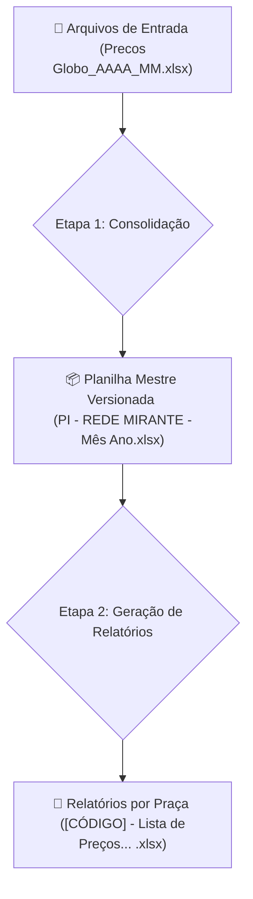

# 📊 Automatizador de Tabela de Preços - Rede Mirante


Este projeto automatiza o ciclo completo de criação e distribuição de tabelas de preços de veiculação para a **Rede Mirante**. O script principal (`script.py`) transforma dados brutos mensais em relatórios finais por praça de exibição, garantindo versionamento, organização e consistência.

## ✨ Principais Funcionalidades

- **Consolidação Automática**: Agrega múltiplos arquivos de preços mensais em uma única base de dados mestre.
- **Versionamento Inteligente**: Cria e organiza planilhas mestre por ano e mês, preservando o histórico sem alterar arquivos originais.
- **Geração de Relatórios**: Produz relatórios individuais e formatados para cada praça de exibição (São Luís, Interior, Imperatriz, etc.).
- **Ordenação Avançada**: Organiza os programas por dia da semana e horário, com uma lógica especial para reaplicações de fim de semana.
- **Estrutura de Arquivos Organizada**: Salva todos os arquivos gerados em uma estrutura de pastas lógica (`saida/ANO/MÊS/`).
- **Prevenção de Duplicidade**: Verifica se um relatório já existe antes de criá-lo, economizando tempo de processamento.

## ⚙️ Fluxo de Trabalho Visual

O processo é executado em uma sequência lógica para transformar dados brutos em relatórios prontos para uso.



## 🗂️ Estrutura de Pastas

Para o correto funcionamento, a estrutura de arquivos e pastas deve ser a seguinte:

```
.
├── 📂 entrada/
│   ├── 📄 PI - REDE MIRANTE.xlsx              # Modelo para a planilha mestre
│   ├── 📄 Lista de Preços e Patrocínios.xlsx # Modelo para os relatórios finais
│   └── 📄 Precos Globo_AAAA_MM.xlsx          # Arquivos com dados brutos mensais
│
├── 📂 saida/
│   ├── 📂 PI/
│   │   └── 📂 [ANO]/
│   │       └── 📄 PI - REDE MIRANTE - [Mês] [Ano].xlsx # Planilhas mestre geradas
│   │
│   └── 📂 ABRANGENCIAS/
│       └── 📂 [ANO]/
│           └── 📂 [MÊS]/
│               └── 📄 [CÓDIGO] - ... - [Mês] [Ano].xlsx # Relatórios finais
│
├── 📜 script.py                   # Script principal de automação
├── 📜 requirements.txt            # Dependências do projeto
└── 📜 README.md                   # Este arquivo
```

## 🚀 Começando

Siga os passos abaixo para configurar o ambiente e executar a automação.

### 1. Pré-requisitos

- Python 3.8 ou superior instalado.
- Acesso ao terminal ou prompt de comando.

### 2. Instalação

Clone este repositório e instale as dependências listadas no `requirements.txt`.

```bash
# Navegue até a pasta do projeto
cd /caminho/para/o/projeto

# Instale as bibliotecas necessárias
pip install -r requirements.txt
```

### 3. Execução

Antes de rodar, prepare os arquivos de entrada e depois execute o script.

**Preparação:**

- [ ] Coloque o arquivo modelo `PI - REDE MIRANTE.xlsx` na pasta `entrada/`.
- [ ] Coloque o arquivo modelo `Lista de Preços e Patrocínios.xlsx` na pasta `entrada/`.
- [ ] Adicione um ou mais arquivos de dados brutos (ex: `Precos Globo_2024_10.xlsx`) na pasta `entrada/`.

**Comando:**

```bash
python script.py
```

O script exibirá o progresso no console e, ao final, os arquivos estarão disponíveis na pasta `saida/`.

---

## 🛠️ Como Funciona: O Detalhe do Processo

### Etapa 1: Consolidação e Versionamento da Base Mestre

Cria uma planilha mestre atualizada e organizada a partir dos dados brutos.

**Entradas:**

- `entrada/PI - REDE MIRANTE.xlsx` (modelo de formatação).
- `entrada/Precos Globo_AAAA_MM.xlsx` (um ou mais arquivos de dados).

**Processo:**

- Identificação do mês recente: o script analisa os arquivos `Precos Globo_...` e escolhe o mais novo para nomear o arquivo mestre.
- Limpeza e pivotagem: transforma os dados em uma tabela organizada.
- Ordenação inteligente: organiza programas por dia da semana e horário.
- Criação de abas: cada mês processado gera uma nova aba (`TABELA_[MÊS]_[ANO]`) na planilha mestre.

**Saída:**

- Arquivo mestre salvo em `saida/PI/[ANO]/PI - REDE MIRANTE - [Mês] [Ano].xlsx`.

---

### Etapa 2: Geração dos Relatórios de Abrangência

Com a base mestre pronta, gera relatórios finais para cada praça.

**Entradas:**

- Arquivo mestre gerado na Etapa 1.
- `entrada/Lista de Preços e Patrocínios.xlsx` (modelo do relatório).

**Processo:**

- Leitura do mestre e iteração por mês e abrangência.
- Verificação de existência: evita criar duplicados.
- Preenchimento do modelo: insere os dados de cada praça.

**Saída:**

- Relatórios `.xlsx` salvos em `saida/ABRANGENCIAS/[ANO]/[MÊS]/`.
- Nome no formato: `[CÓDIGO] - Lista de Preços e Patrocínios - [Mês] [Ano].xlsx`.
